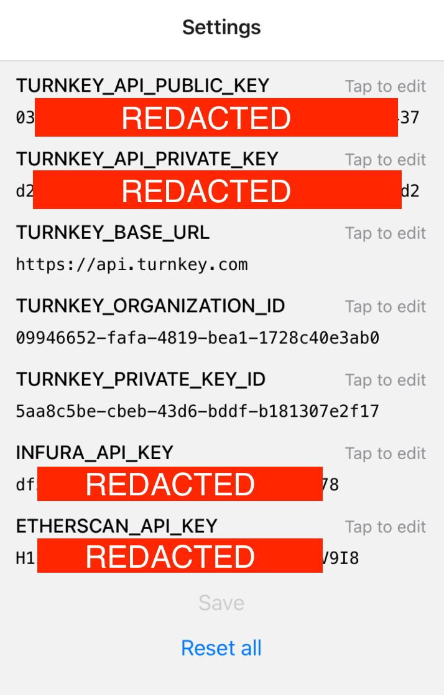
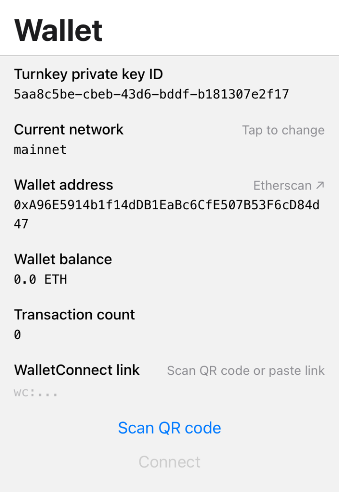

# Turnkey Demo: Consumer Wallet

## Introduction

This repository features a minimal consumer wallet app powered by Turnkey. Behind the scenes, it uses [`@turnkey/ethers`](https://github.com/tkhq/sdk/tree/main/packages/ethers) for signing and WalletConnect (v1) for accessing dapps.

With Turnkey, you can easily build wallet apps leveraging the existing ecosystem; `TurnkeySigner` is a drop-in replacement for `ethers.Wallet`, but with fine-grained transaction controls via [Turnkey policies](https://turnkey.readme.io/docs/policy-quickstart-1), all without compromising on security.

https://github.com/tkhq/demo-consumer-wallet/assets/127255904/2c3409df-2d7c-4ec3-9aa8-e2944a0b0e0a

## Getting started

Make sure you have Node.js installed locally; we recommend using Node v16+.

```bash
$ node --version # v16+
$ git clone https://github.com/tkhq/demo-consumer-wallet
$ cd demo-consumer-wallet/
$ corepack enable # Updates npm for the local project

$ npm install
$ npm start # Follow the instructions on screen to build to your device or a simulator
```

To configure the demo passkey wallet you'll need the following:
* A Turnkey organization ID: you can create one by following our [quickstart guide](https://docs.turnkey.com/getting-started/quickstart).
* A new Turnkey API key (public/private key pair). You can generate one using [our CLI](https://github.com/tkhq/tkcli), or through the Turnkey dashboard dashboard
* Turnkey's base URL: you can leave the default of `https://api.turnkey.com`.
* A new Turnkey private key ID: head to "Private Keys" in your Turnkey dashboard and create a new one ("Create private key"). The "Curve type" should be "SECP256K1", and the "Asset address type" should be "ETHEREUM".
* An account on [Infura](https://www.infura.io/) and [Etherscan](https://etherscan.io/)

You'll provide this information on first app start in the settings screen:



Upon clicking "Save" the settings are saved in your phone's keychain and  you should see your wallet address and ETH balance:

 

## Technical tl;dr

Turnkey API keys and other credentials are encrypted and stored in your phone's Keychain: https://github.com/tkhq/demo-consumer-wallet/blob/e479ed7c0db8037e36166c6e2464ceb3d38bd848/src/turnkey/CredentialsContext.tsx#L111

Create a [`TurnkeySigner`](https://github.com/tkhq/sdk/tree/main/packages/ethers), bring your own provider, then bridge it via EIP-1193:
https://github.com/tkhq/demo-consumer-wallet/blob/e479ed7c0db8037e36166c6e2464ceb3d38bd848/src/turnkey/TurnkeyWalletContext.tsx#L61-L75

WalletConnect payloads are signed by Turnkey and broadcasted by your provider, all via the bridge:
https://github.com/tkhq/demo-consumer-wallet/blob/e479ed7c0db8037e36166c6e2464ceb3d38bd848/src/screens/WalletConnectScreen.tsx#L222-L225
